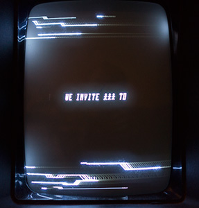

# invitron
Invitron by Frog //ROi 
32k Invitation intro to Chaos Constructions'2015 for Vectrex 
Released at Solskogen'2015 

I strongly recommend run it only on real hardware (Vectrex). It runs under emulator (ParaJVE), but looks bad.

AS09 Assembler for M6809 v1.41/Win by Frank A. Kingswood was used

If you don't have Vectrex, check out Youtube video: https://www.youtube.com/watch?v=vf_fb8G5Rdc

Vectrex rulez!

p.s. credits goes to Svo for ROM emulator card and C-Jeff for music

License: MIT
